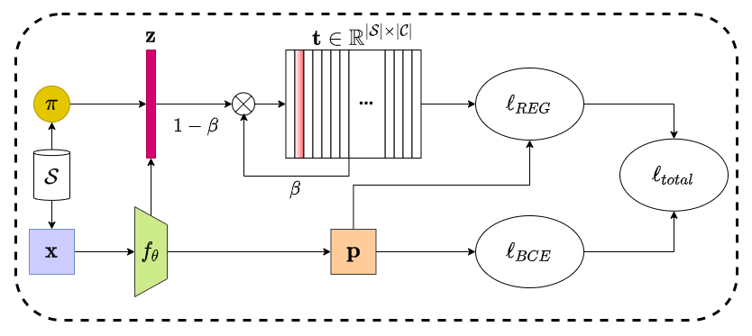

# NVUM

This repository is the official implementation of MICCAI 2022 (Early Accept) [NVUM: Non-volatile Unbiased Memory for Robust Medical Classification](https://arxiv.org/abs/2103.04053). 



## Requirements

- To install requirements:
  ```setup
  pip install -r requirements.txt
  ```
- 1 * NVIDIA RTX 2080ti
## Datasets Preparation
Refer to [dataset_preparation](dataset_preparation/)
## Training

Train on NIH

```
python train.py --trim_data --run_name NVUM_NIH --train_root_dir <NIH_dir> --openi_root_dir <OPI_dir> --pc_root_dir <PDC_dir> --save_dir <save_dir> --nvcm --lm
```

Train on CXP
```
python train.py --trim_data --run_name NVUM_CXP --train_root_dir <CXP_dir> --openi_root_dir <OPI_dir> --pc_root_dir <PDC_dir> --save_dir <save_dir> --batch_size 64 --lr 0.0001 total_epochs 40 --resize 224 --num_classes 8 --nvcm --lm
```
## Credits
- Part of the code are from [TorchXrayVision](https://github.com/mlmed/torchxrayvision).

## Citation

If you find this repo useful for your research, please consider citing our paper:

```bibtex
@article{liu2021NVUM,
  title={NVUM: Non-volatile Unbiased Memory for Robust Medical Classification},
  author={Liu, Fengbei and Yuanhong Chen and Tian, Yu and Yuyuan Liu and Chong Wang and Belagiannis, Vasileios and Carneiro, Gustavo},
  journal={arXiv preprint arXiv:2103.04053v2},
  year={2021}
}
```
